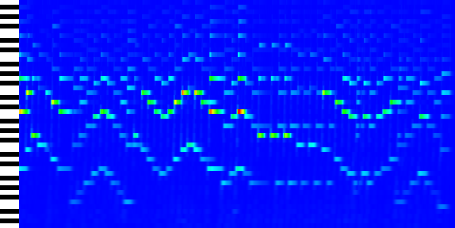
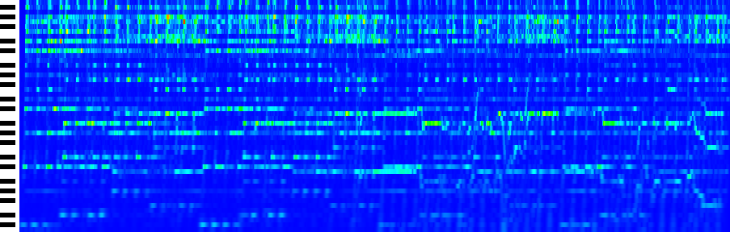

# Subtune

A rust tool to analyze audio files.

The project aims to be a complete tool to convert audio files into other representations. At the moment, it only
supports converting wav files into a .png image that contains its wavelet transform.

In the beginning, the focus will be on music files (and streams), using the wavelet transform to extract music sheets.

## Examples

A random piano sample:



With 3 frequencies per note:


A Coldplay song:



## Usage

To build to project, simply run
```cargo build --release```

Below a minimal example, which will create a **file.png** with file.wav's wavelet transform.

```
subtune -i <path/to/file.wav> 
```

More from --help:

```
Usage: subtune [OPTIONS] --input <INPUT>

Options:
  -i, --input <INPUT>
          Input wav file path
  -o, --output <OUTPUT>
          Output image file (png) path
  -n, --num-octaves <NUM_OCTAVES>
          Number of octaves to analyze, default 9
  -s, --start-octave <START_OCTAVE>
          Index of first octave (default 1 = C1-B1). Negative allowed
  -r, --resampling-strategy <RESAMPLING_STRATEGY>
          Resampling strategy [max, avg] (default max)
  -c, --color-scheme <COLOR_SCHEME>
          Color scheme [heatmap, grayscale] (default heatmap)
      --pixels-per-second <PIXELS_PER_SECOND>
          Pixels per second on the horizontal axis of the resulting image (default 32)
      --pixels-per-frequency <PIXELS_PER_FREQUENCY>
          Pixels per frequency on the vertical axis of the resulting image (default 6)
  -p, --piano-roll
          If this flag is present, adds a simple piano roll in the resulting image
  -d, --display
          If this flag is present, opens a window to show the resulting image
  -h, --help
          Print help
  -V, --version
          Print version

```

## Performance

At 44.1K sample rate, with default parameters, computing a wavelet transform takes about 1/6th of the track duration on
the test machine. This should be enough for the goal of live audio transcription.

Performance can be further improved to increase frequency resolution and/or decrease run time for
longer/higher sample rate files.

### Benchmarks

Tests on MacBook Pro 2019, Intel i5-1038NG7 CPU @ 2.00GHz, 4 cores, timing wavelet transform only.

| Samples | Frequencies | Time  |
|---------|-------------|-------|
| 140K    | 600         | 3.4s  |
| 600K    | 600         | 26.2s |
| 1.7M    | 100         | 6.3s  |
| 1.7M    | 300         | 20.7s |

## Todo

- [ ] Different wavelet types
- [ ] Improve code base, extract crates
- [ ] Support any audio format
- [ ] Music sheet output
- [ ] Performance improvements (GPU support)
- [ ] Transform live audio
- [ ] Interactive GUI

## License

This project is licensed under [Apache 2.0 License](LICENSE)


